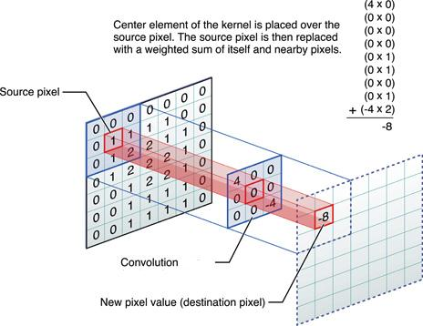

# Produit de convolution d'une matrice en C

J'ai crée ce projet pour un devoir scolaire.

### Comment utiliser

Telcharger le projet en format zip (Vous pouvez meme utiliser ==git clone== https://github.com/tarek-mo/produit-convolution) et lancer app.exe, c'est tout

### Fonctionnement

Lors du lancement du ==app.exe==:
1- Vous serez etre demander de saisie une taille pour votre matrice, le program va creer une matrice carrée aléatoire en arriére plan. (Des 0 seront étre placé autour du matrice pour les cas extremes de votre matrice)

2- Puis vous spécifierez la taille du filtre de convolution (souvent ==3x3== est utilisé). La taille n doit étre impaire est dans l'intervalle ==[1, n/3]== avec n la taille du matrice crée en etape 1

3- Remplissage du filtre de convolution par vous

4- Voila, la matrice resultat est affiché enfin 🚀

## Contribution

Vous pouvez forker cette repertoire dans github et ajouter des fonctionalités sur ce program, puis creer une ==pull request== et je vais merger votre contribution.
